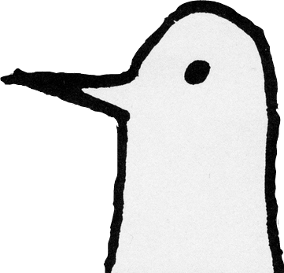

<h2>I'm Ruslan</h2>

<em>Computer Engineering and Mathematics @ University of Maryland</em>

<h2>Featured Projects</h2>

**[noogie](https://github.com/ruslannnn2/noogie)**  
`Python, Flask, React, OpenAI API`  
*Best Design @PennApps 2025*

News aggregation platform that collects, clusters, and summarizes breaking news from across the web to mitigate biases that different news sources give. Automatically fetches articles from major outlets, groups similar stories, and generates concise headlines.

 

**[Fries in the bag](https://github.com/eggoil166/friesinthebag)**  
`Python, Flask, React, TypeScript, Vite, Tailwind CSS`
*Best Digital Forensics Hack @ HoyaHacks 2026*

Audio steganography tool that encodes messages into WAV files using high-frequency signals beyond human hearing range. Features real-time spectrogram visualization and interactive web interface for encoding and decoding hidden messages in audio files.

 

**[The Daily Indigest](https://github.com/ruslannnn2/Daily-Indigest)**  
`Python, Flask, React, Google Gemini, Node.js, Rust, SpacetimeDB`  
*Best Data-Driven Hack @HopHacks 2025*

Interactive visualization platform that maps tweets with location data and provides AI-powered trend explanations including sentiment analysis through Gemini API.

  

